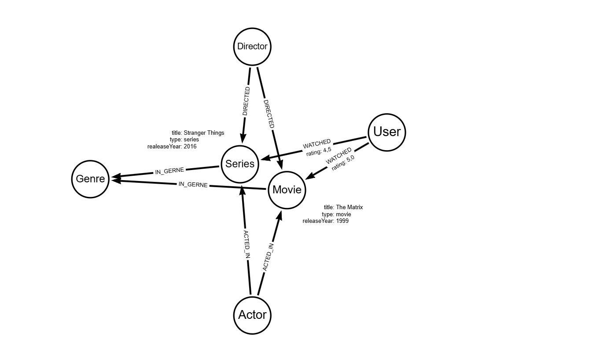

# Banco de Dados em Grafos para Plataforma de Streaming (DIO)

Este repositório contém o projeto prático de modelagem e implementação de um banco de dados em grafos utilizando o **Neo4j** e a linguagem **Cypher**. O objetivo foi simular a estrutura de dados por trás de uma plataforma de streaming de vídeo (como Netflix, Prime Video) para conectar usuários, conteúdos e preferências.

## Contexto do Problema e Escolha por Grafos

Sistemas de recomendação tradicionais sofrem com lentidão ao realizar cruzamentos complexos (JOINS) em bancos de dados relacionais (SQL). A escolha por um **banco de dados em grafos** se justifica pela necessidade de mapear conexões orgânicas e rápidas entre quem assiste e o que é assistido, permitindo queries de recomendação em tempo real através da análise de relacionamentos.

## Estrutura do Modelo (Esquema do Grafo)

O grafo foi desenhado inicialmente na ferramenta *Arrows.app*. Abaixo está a representação visual do esquema planeado para o banco de dados:

### Elementos do Modelo:
Nós (Labels):
  * `User`: Representa os clientes da plataforma (Propriedades: `id`, `name`).
  * `Movie`: Representa os longa-metragens (Propriedades: `id`, `title`, `releaseYear`).
  * `Series`: Representa as produções seriadas (Propriedades: `id`, `title`, `releaseYear`).
  * `Genre`: Representa as categorias de conteúdo (Propriedades: `name`).

Relacionamentos:
  * `(:User)-[:WATCHED {rating: float}]->(:Movie / :Series)`: Conecta o usuário ao conteúdo que ele assistiu, armazenando a nota de avaliação dada por ele.
  * `(:Movie / :Series)-[:IN_GERNE]->(:Genre)`: Classifica os conteúdos dentro de suas respectivas categorias.

## 🛠️ Conteúdo do Repositório

'script.cypher': Script SQL-like com comandos Cypher comentados contendo:
  * Criação de **Constraints** de unicidade para garantir integridade dos IDs.
  * Carga inicial (população) de **10 Usuários**, **10 Filmes**, **10 Séries** e **7 Gêneros** (incluindo adições personalizadas de Romance e Suspense).
  * Criação de **20 Relacionamentos** simulados de visualização com notas de avaliação.

Desafios encontrados ao longo do projeto.

Durante o desenvolvimento do script, o maior desafio foi compreender a sintaxe de criação de relacionamentos em duas etapas do "Cypher", que exige o uso combinado do comando MATCH (para localizar os nós previamente existentes no banco) e do "CREATE"(para desenhar a aresta/seta direcional entre eles). Outro ponto de atenção foi a correção de pequenos detalhes de sintaxe de strings e pontuações diretamente no editor de código antes da execução no console do Neo4j.

